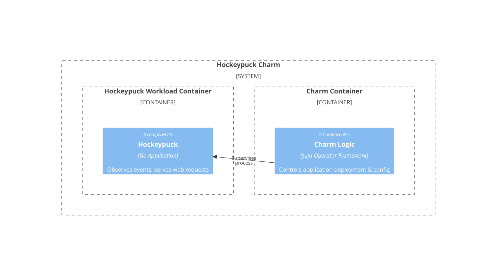

# Charm architecture

At its core, [Hockeypuck](https://hockeypuck.io/) is a [Go](https://go.dev/) application that integrates with [PostgreSQL](https://www.postgresql.org/) and [Traefik](https://traefik.io/traefik/). The [Hockeypuck charm](https://github.com/canonical/hockeypuck-k8s-operator) was developed using the [12-factor Go framework](https://canonical-charmcraft.readthedocs-hosted.com/en/stable/reference/extensions/go-framework-extension/). This framework allows us to easily deploy and operate Hockeypuck and its associated infrastructure, such as databases and ingress.

> See more: [Web app support in Charmcraft and Rockcraft](https://canonical-12-factor-app-support.readthedocs-hosted.com/en/latest/)

## Charm architecture diagram

Below is a diagram of the application architecture of the Hockeypuck charm.



The charm design leverages the [sidecar](https://kubernetes.io/blog/2015/06/the-distributed-system-toolkit-patterns/#example-1-sidecar-containers) pattern to allow multiple containers in each pod with [Pebble](https://ops.readthedocs.io/en/latest/reference/pebble.html) running as the workload container’s entrypoint.

Pebble is a lightweight, API-driven process supervisor that is responsible for configuring processes to run in a container and controlling those processes throughout the workload lifecycle.

Pebble `services` are configured through [layers](https://github.com/canonical/pebble#layer-specification), and the following container represents one layer forming the effective Pebble configuration, or `plan`:

1. The [Hockeypuck](https://hockeypuck.io/) container itself, which has a webserver configured in HTTP mode.

As a result, if you run a `kubectl get pods` on a namespace named for the Juju model you've deployed the Hockeypuck charm into, you'll see something like the following:

```bash
NAME                                    READY    STATUS    RESTARTS   AGE
hockeypuck-k8s-0                         2/2     Running   0         6h4m
```

This shows there are 2 containers - the one named above, as well as a container for the charm code itself.

And if you run `kubectl describe pod hockeypuck-k8s-0`, all the containers will have a command ```/charm/bin/pebble```. That's because Pebble is responsible for the processes' startup as explained above. 

## OCI images

We use [Rockcraft](https://canonical-rockcraft.readthedocs-hosted.com/en/latest/) to build the OCI image for the Hockeypuck charm. 
The image is defined in [hockeypuck-k8s rock](https://github.com/canonical/hockeypuck-k8s-operator/blob/main/hockeypuck_rock/rockcraft.yaml).
The rock and the charm are published to [Charmhub](https://charmhub.io/), the official repository of charms.

> See more: [How to publish your charm on Charmhub](https://canonical-charmcraft.readthedocs-hosted.com/en/stable/howto/manage-charms/#publish-a-charm-on-charmhub)

## Metrics

Metrics are provided by the workload container at the `/metrics` endpoint at port 9626. 
See [Metrics](https://charmhub.io/hockeypuck-k8s/docs/reference-metrics) for a full list.
 
## Juju events

For this charm, the following Juju events are observed:

1. [app_pebble_ready](https://documentation.ubuntu.com/juju/3.6/reference/hook/index.html#container-pebble-ready): fired on Kubernetes charms when the requested container is ready. **Action**: validate the charm configuration, run pending migrations and restart the workload.

2. [config_changed](https://documentation.ubuntu.com/juju/latest/reference/hook/index.html#config-changed): usually fired in response to a configuration change using the CLI. **Action**: validate the charm configuration, run pending migrations and restart the workload.

3. [secret_storage_relation_created](https://documentation.ubuntu.com/juju/latest/reference/hook/index.html#endpoint-relation-created): fired when the relation is first created. **Action**: generate a new secret and store it in the relation data.

4. [secret_storage_relation_changed](https://documentation.ubuntu.com/juju/latest/reference/hook/index.html#endpoint-relation-changed): fired when a new unit joins in an existing relation and whenever the related unit changes its settings. **Action**: validate the charm configuration, run pending migrations and restart the workload.

5. [secret_storage_relation_departed](https://documentation.ubuntu.com/juju/latest/reference/hook/index.html#endpoint-relation-departed): fired when a unit departs from an existing relation. **Action**: validate the charm configuration, run pending migrations and restart the workload.

6. [update_status](https://documentation.ubuntu.com/juju/latest/reference/hook/index.html#update-status): fired at regular intervals. **Action**: validate the configuration, run pending migrations and restart the workload.

7. [secret_changed](https://documentation.ubuntu.com/juju/latest/reference/hook/index.html#secret-changed): fired when the secret owner publishes a new secret revision. **Action**: validate the configuration, run pending migrations and restart the workload.

8. [database_created](https://github.com/canonical/data-platform-libs): fired when a new database is created. **Action**: validate the charm configuration, run pending migrations and restart the workload.

9. [endpoints_changed](https://github.com/canonical/data-platform-libs): fired when the database endpoints change. **Action**: validate the charm configuration, run pending migrations and restart the workload.

10. [database_relation_broken](https://github.com/canonical/data-platform-libs): fired when a unit participating in a non-peer relation is removed. **Action**: validate the charm configuration, run pending migrations and restart the workload.

11. [ingress_ready](https://github.com/canonical/traefik-k8s-operator): fired when the ingress for the app is ready. **Action**: validate the charm configuration, run pending migrations and restart the workload.

12. [ingress_revoked](https://github.com/canonical/traefik-k8s-operator): fired when the ingress for the web app is not ready anymore. **Action**: validate the charm configuration, run pending migrations and restart the workload.

13. [rotate_secret_key](https://documentation.ubuntu.com/juju/latest/user/reference/action/): fired when secret-rotate is executed.  **Action**: generate a new secret token for the application.

14. [block_keys_action](https://documentation.ubuntu.com/juju/latest/reference/action/): fired when the block_keys action is run. **Action**: deletes the required keys from the database and adds them to the blocklisted keys list.

15. [rebuild_prefix_tree_action](https://documentation.ubuntu.com/juju/latest/reference/action/): fired when the rebuild_prefix_tree action is run. **Action**: Rebuilds the ptree used by Hockeypuck.

16. [lookup_key_action](https://documentation.ubuntu.com/juju/latest/reference/action/): fired when the lookup_key action is run. **Action**: Searches for the required key in the database.


> See more in the Juju docs: [Hook](https://documentation.ubuntu.com/juju/latest/reference/hook/)

## Charm code overview

The `src/charm.py` is the default entry point for a charm and has the `HockeypuckK8SCharm` Python class that inherits from `PaasCharm`, which internally uses `CharmBase`. `CharmBase` is the base class from which all charms are formed, defined by [Ops](https://ops.readthedocs.io/en/latest/) (Python framework for developing charms).

> See more in the Juju docs: [Charm](https://documentation.ubuntu.com/juju/latest/reference/charm/)

The `__init__` method guarantees that the charm observes all events relevant to its operation and handles them.

Take, for example, when a configuration is changed by using the CLI.

1. User runs the configuration command:
```bash
juju config hockeypuck-k8s app-port=11371
```
2. A `config-changed` event is emitted.
3. In the `__init__` method is defined how to handle this event like this:
```python
self.framework.observe(self.on.config_changed, self._on_config_changed)
```
4. The method `_on_config_changed`, for its turn, will take the necessary actions such as waiting for all the relations to be ready and then configuring the containers.